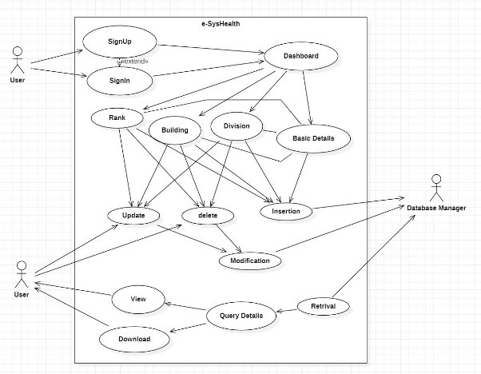
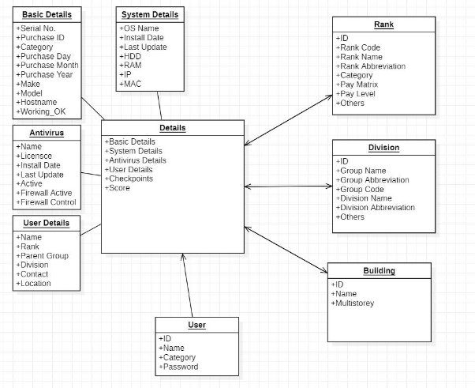
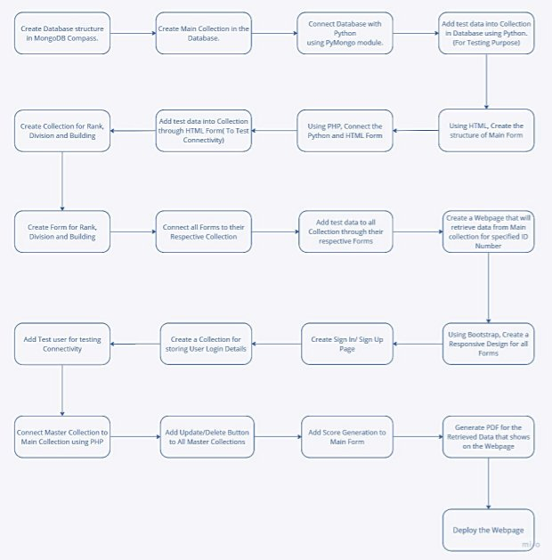

# e-SysHealth
A Fullstack Project as Project Assign during DRDO Internship

This report presents a comprehensive analysis of form modules used in web development, focusing on the integration and utilization of PHP, HTML, JavaScript, CSS, Bootstrap, Python and MongoDB. The report provides an in-depth understanding of each technology and its role in creating interactive and user-friendly web forms. It explores the process of designing and implementing forms using HTML for structure, CSS for styling, and JavaScript for interactivity, PHP for client-side validation and Python for Backend Management. Additionally, it delves into the server-side processing of form data using PHP, including data storage and retrieval with MongoDB databases. The report also examines the benefits of incorporating Bootstrap framework for responsive and mobile-friendly form designs.The utilization of MongoDB, a powerful NoSQL Database system, is also examined, highlighting its role in securely storing and managing form data. Furthermore, it discusses best practices and common challenges in form development and offers practical solutions. The focus remains on creating forms that are user-friendly, intuitive, and capable of capturing accurate data.

**USE CASE DIAGRAM 

**OBJECT DIAGRAM 

**WORKFLOW DIAGRAM 

